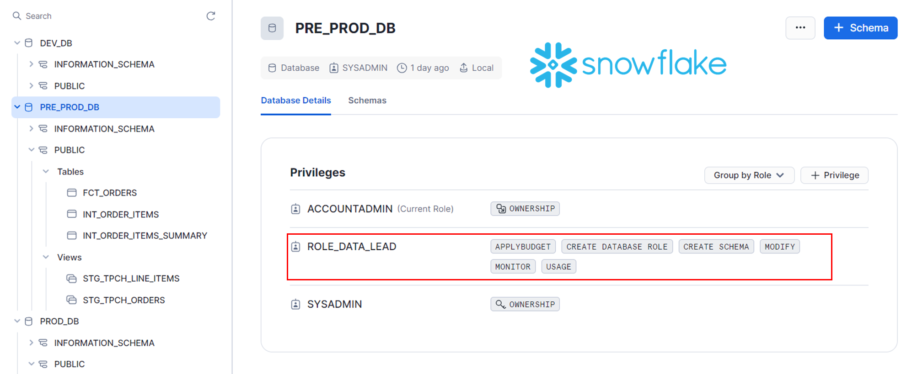
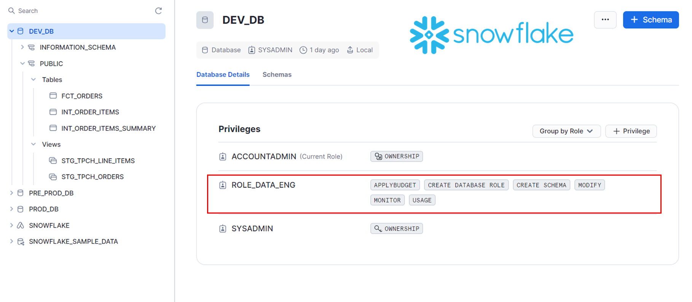
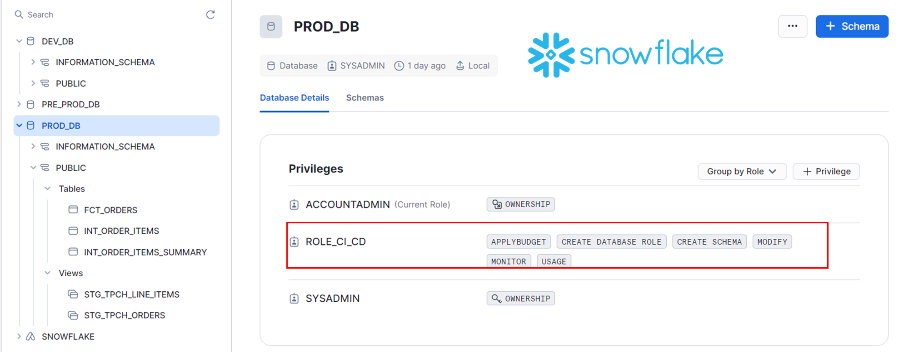

# demo_initial

Ce dépôt contient un projet dbt (Data Build Tool) pour la transformation des données dans Snowflake, un fichier de setup de l'infra sur Snowflake. Avec un workflow structuré sur deux branches et trois environnements de bases de données : DEV_DB, PRE_PROD_DB, et PROD_DB. 

*DEMO POMONA*

## Structure du projet

- **analyses/** : Requêtes SQL analytiques.
- **models/** : Modèles dbt définissant des transformations SQL.
- **tests/** : Tests de validation des données.
- **snapshots/** : Captures de données dans le temps.
- **setup_scripts/** : Scripts d’initialisation du projet.

**N.B** : Le processus pourra être adapté en fonction des besoins.

## Prérequis

1. **dbt** : Installer dbt ([guide d'installation](https://docs.getdbt.com/docs/installation)).
2. **Snowflake** : Configurer `profiles.yml` pour connecter dbt à Snowflake.

## Branches et Gestion des Environnements

Le projet suit un flux de travail structuré en deux branches et trois environnements Snowflake :

- **develop** : Branche de développement, associée à la base de données `DEV_DB`.
- **prod** : Branche de production, associée à la base de données `PROD_DB`.

Les bases de données sont configurées de la manière suivante :
- **DEV_DB** : Pour le développement et les tests manuels.
- **PRE_PROD_DB** : Pour les tests automatisés dans l'environnement de préproduction.
- **PROD_DB** : Environnement de production.

### Flux de travail

1. **Développement sur `DEV_DB`** :  
   - Le développement est fait manuellement sur des branches `feature/` dérivées de `develop` et directement testé sur `DEV_DB`.
   
2. **Intégration dans `develop`** :
   - Une fois la fonctionnalité terminée, elle est fusionnée dans la branche `develop` via une Pull Request (PR).
   - Le premier workflow CI est déclenché lors de la création d'une PR. Ce workflow alimente la base de données `PRE_PROD_DB` et exécute des tests automatisés sur les modèles dbt.
   
3. **Fusion dans `prod` et déploiement** :
   - Après la clôture réussie de la PR et son merge dans `develop`, un second workflow CD est déclenché. Ce workflow, combiné avec un **cron schedule**, permet de déployer et de rafraîchir les modèles dans la base de données `PROD_DB`.

## Workflows CI/CD

1. **CI Workflow** : 
   - Déclenché à la création d'une PR, il exécute les tests et valide les modèles dbt sur `PRE_PROD_DB`.
   
2. **CD Workflow** :
   - Déclenché après le merge de la PR et à intervalle régulier (grâce à un cron job), il maintient les modèles à jour dans `PROD_DB`.

## Dossier setup_scripts

Le dossier `setup_scripts` contient les DDL nécessaires pour configurer l'infrastructure et le RBAC dans Snowflake (rôles, utilisateurs, virtual warehouses, etc.).  
L'extension Snowflake sur **VSCode** est optimale pour exécuter ces scripts directement.

## Lancer dbt :D

Après la configuration, pour exécuter les modèles :
```bash
dbt run 
```

## Quelques Résultats
Ci-dessous, trois figures illustrant les environnements `DEV_DB`, `PRE_PROD_DB`, et `PROD_DB` dans Snowflake :


- **Figure 1** : Environnement de développement (`DEV_DB`) où le travail est fait manuellement.


- **Figure 2** : Environnement de préproduction (`PRE_PROD_DB`) pour les tests automatisés avec le workflow CI.


- **Figure 3** : Environnement de production (`PROD_DB`) alimenté via le workflow CD et mis à jour régulièrement.